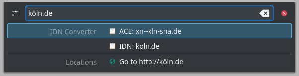
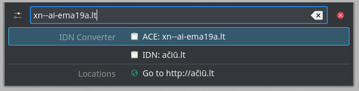

# KRunner IDN Converter

A small KRunner plugin (Plasma 6) that converts internationalized domain names (IDN) to and from Punycode.

An IDN such as `münchen.de` contains non-ASCII characters. The DNS only handles ASCII, so the same domain is also written in its Punycode-based ASCII-compatible encoding (ACE): `xn--mnchen-3ya.de`. The plugin shows both forms, following the IDNA standard ([UTS #46](https://www.unicode.org/reports/tr46/), nontransitional processing, so e.g. `ß` is kept rather than turned into `ss`).

## Usage

Open KRunner and enter a domain name in either form. The IDN and ACE (Punycode) forms are shown in the search results:




Pressing Enter copies the selected form to the clipboard.

## Installation

Requirements: CMake, Extra CMake Modules, Qt 6, KDE Frameworks 6 (KRunner, KI18n) and the [ICU library](https://icu.unicode.org/).

Build and install:

```sh
cmake -B build -DCMAKE_INSTALL_PREFIX=/usr -DCMAKE_BUILD_TYPE=Release
cmake --build build
sudo cmake --install build
```

Run the tests (optional): `ctest --test-dir build`

Restart KRunner: `kquitapp6 krunner` (or, where KRunner runs as a systemd user service: `systemctl --user restart plasma-krunner`).

Make sure the new plugin is enabled in the KRunner settings and you're ready to go!

## License

KRunner IDN Converter is licensed under the [MIT license](LICENSE).
